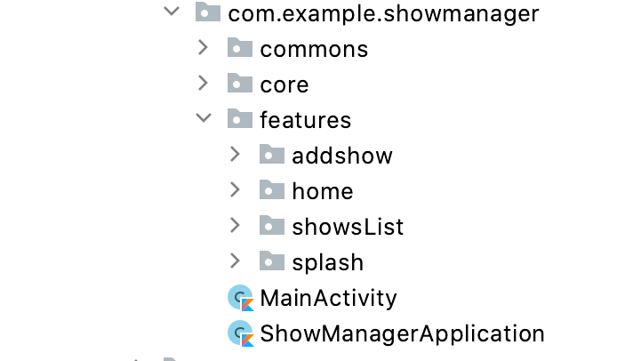

## The TV Show Manager

TV Show manager in a sample app for people who watch so many tv shows and can't keep track of them.

The goal of the project is to demonstrate best practices, application architecture that scalable, maintainable and testable. This application may look simple, but it
has all of these small details that will set the rock-solid foundation of the larger app suitable for bigger teams and
long application lifecycle management.

## Development

### Environment setup

First off, you require the latest Android Studio Arctic Fox (or newer) to be able to build the app.

### Code style

To maintain the style and quality of the code, [ktlint](https://github.com/pinterest/ktlint) has been configured as a static analysis tool.

## Architecture

The architecture of the application is based, apply and strictly complies with each of the following 5 points:

-   A single-activity architecture, using the [Navigation component](https://developer.android.com/guide/navigation/navigation-getting-started) to manage fragment operations.
-   [Android architecture components](https://developer.android.com/topic/libraries/architecture/), part of Android Jetpack for give to project a robust design, testable and maintainable.
-   Pattern [Model-View-ViewModel](https://en.wikipedia.org/wiki/Model%E2%80%93view%E2%80%93viewmodel) (MVVM) facilitating a [separation](https://en.wikipedia.org/wiki/Separation_of_concerns) of development of the graphical user interface.
-   [S.O.L.I.D](https://en.wikipedia.org/wiki/SOLID) design principles intended to make software designs more understandable, flexible and maintainable.
-   [Domain Layer](https://www.raywenderlich.com/3595916-clean-architecture-tutorial-for-android-getting-started) Contains the business logic of the app.

### Packages

#### Core

The core is an if for handling network requests or accessing to the database. Providing the data source for the many features that require it.

#### Features 

The features package contains the individual features in the application.

#### Commons 

The commons contains code which are shared between feature modules reducing the need to duplicate code.
